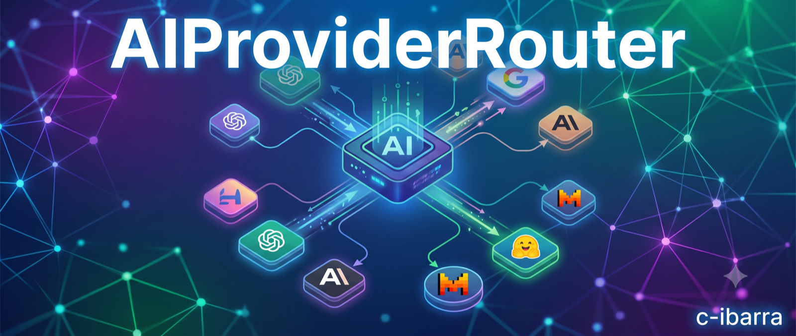
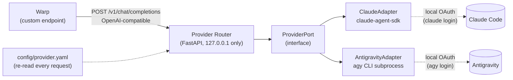

# ai-provider-router


A local, config-driven router that lets a single OpenAI-compatible endpoint talk to **either Claude or Antigravity**, decided by configuration instead of hardcoded into the client. Point [Warp](https://www.warp.dev/) (or any OpenAI-compatible tool) at one endpoint; swap providers by editing a YAML file — no restart, no client-side change.

> Personal-use portfolio project. Not affiliated with or endorsed by Anthropic or Google. See [`docs/DISCLAIMER.md`](docs/DISCLAIMER.md).

## Why this project

This repo is a portfolio piece built to be read, not just run. It's a small system, but every layer was deliberately engineered and documented — the kind of decisions that matter more on a team than the line count:

- **Decisions recorded, not just made.** Every non-obvious technical choice has an [ADR](docs/adr/) explaining the trade-off and the alternatives that were rejected — including one rejected specifically for violating a vendor's Terms of Service, caught before it shipped.
- **Primary-source technical research.** Before committing to an integration approach, this project verified vendor CLI behavior, SDK source code, and GitHub issues directly (not blog posts) — see [`docs/research/`](docs/research/).
- **Test-driven development, actually followed.** 35 tests, red-green-refactor, written before implementation for every module with real behavior — see [`tests/`](tests/).
- **Hexagonal architecture** (ports & adapters) applied where it earns its keep: two genuinely different provider integrations (an official Python SDK vs. a CLI subprocess) behind one interface, not abstraction for its own sake.
- **Compliance-by-design.** Both providers are driven through the author's own local OAuth sessions — no API keys, no proxying, no shared credentials, no scraping. See [`docs/DISCLAIMER.md`](docs/DISCLAIMER.md).

## What it does



- One endpoint, one config file. `default_provider` in [`config/provider.yaml`](config/provider.yaml) decides who answers.
- Claude is driven in-process via the official `claude-agent-sdk`, with real token-by-token SSE streaming.
- Antigravity is driven via the official `agy` CLI's headless mode as a subprocess, with automatic retry on a known reliability bug (verified against the vendor's own GitHub issue tracker).
- Stateless by design: every request carries its own full conversation history, so there's no server-side session store to build or lose.
- Chat-only by design: no file edits, no shell commands — this is a conversational proxy, not a remote-control surface.

Full technical rationale for each of these choices lives in [`docs/adr/`](docs/adr/).

## Quick start

```sh
uv sync                                     # install dependencies
uv run pytest                               # 35 tests, all green
uv run python -m router.adapters.http.main  # serve on http://127.0.0.1:8000
```

Requires `claude` and `agy` CLIs installed and logged in locally — the router never stores or requests credentials of its own. Full setup, configuration, and Warp integration steps: [`docs/README.md`](docs/README.md).

## Project layout

```
router/
  domain/        # ProviderPort, Transcript, retry policy — framework- and vendor-agnostic
  adapters/
    claude/      # ClaudeAdapter (claude-agent-sdk)
    antigravity/ # AntigravityAdapter (agy CLI subprocess)
    http/        # FastAPI app, config loader, startup checks, logging
tests/           # mirrors router/, one test module per adapter/domain module
docs/adr/        # architecture decisions, with rejected alternatives and why
docs/research/   # primary-source investigation notes
openspec/        # the spec-driven change history: proposal → design → tasks
```

## Documentation map

| Doc | What it's for |
|---|---|
| [`openspec/PROJECT_SPEC.md`](openspec/PROJECT_SPEC.md) | Full requirements spec |
| [`docs/README.md`](docs/README.md) | Setup, configuration, running it, using it from Warp |
| [`docs/architecture.md`](docs/architecture.md) | Ports & adapters diagram, request sequence |
| [`docs/adr/`](docs/adr/) | Architecture decisions and why |
| [`docs/research/`](docs/research/) | Primary-source technical research |
| [`docs/DISCLAIMER.md`](docs/DISCLAIMER.md) | Compliance and usage disclaimer |
