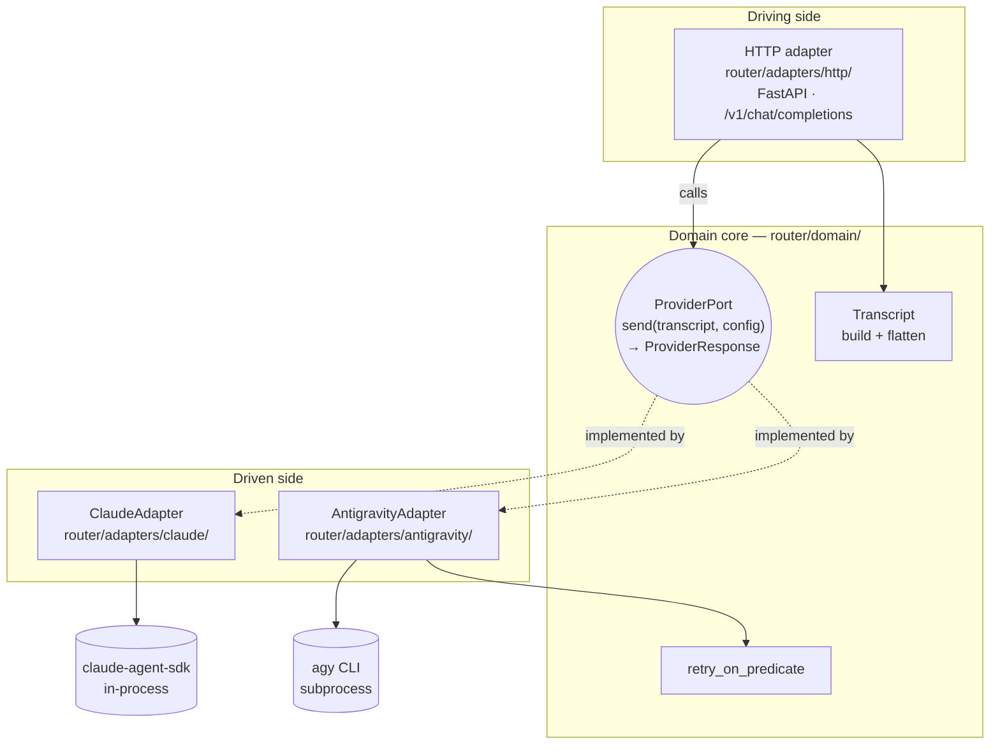
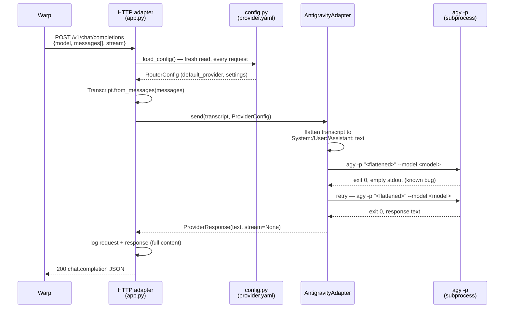

# Architecture

Two diagrams: the hexagonal (ports & adapters) shape the codebase follows, and the sequence of an actual request through it. See [`docs/adr/0002-hexagonal-architecture.md`](adr/0002-hexagonal-architecture.md) for the rationale behind the shape itself.

## Ports & adapters

The **domain core** (`ProviderPort`, `Transcript`, `retry_on_predicate`) has no import of FastAPI, `claude_agent_sdk`, or subprocess handling — it only knows the shape of a request and a response. Everything vendor- or framework-specific lives in an adapter:

- **Driving adapter** (`adapters/http/`) — the thing that calls *into* the core. Translates an OpenAI-shaped HTTP request into a `Transcript` + `ProviderConfig`, and a `ProviderResponse` back into an OpenAI-shaped HTTP response (JSON or SSE).
- **Driven adapters** (`adapters/claude/`, `adapters/antigravity/`) — the things the core calls *out* to. Each implements `ProviderPort.send()` against a genuinely different transport: an in-process SDK call vs. a CLI subprocess.

Swapping FastAPI for another framework, or adding a third provider, touches only its own adapter — the core and the other adapters don't change.

## Request sequence

A single non-streaming request through the Antigravity leg, including the retry path:

The Claude leg follows the same shape but skips the subprocess/retry steps — `ClaudeAdapter` calls `claude_agent_sdk.query()` in-process and, when the caller requested streaming, returns a live token stream that the HTTP adapter frames as SSE chunks instead of one JSON body.

## Related documents

- [`docs/adr/0001-antigravity-cli-over-sdk.md`](adr/0001-antigravity-cli-over-sdk.md) — why the Antigravity leg is a CLI subprocess, not the official SDK
- [`docs/adr/0002-hexagonal-architecture.md`](adr/0002-hexagonal-architecture.md) — why ports & adapters at all
- [`docs/adr/0003-stateless-chat-only-scope.md`](adr/0003-stateless-chat-only-scope.md) — why there's no session store and no tool access
